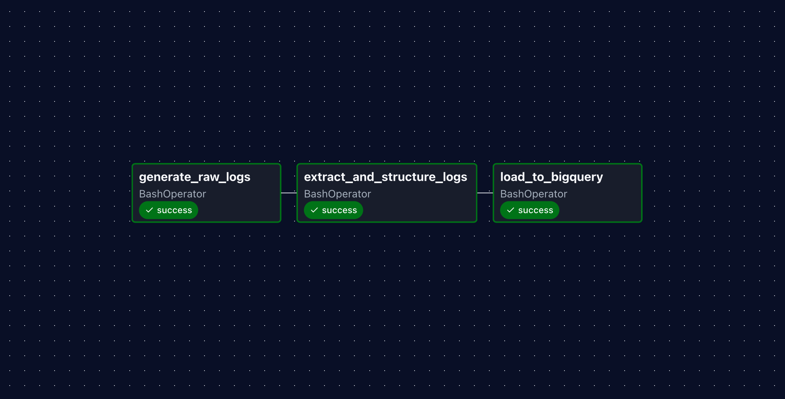
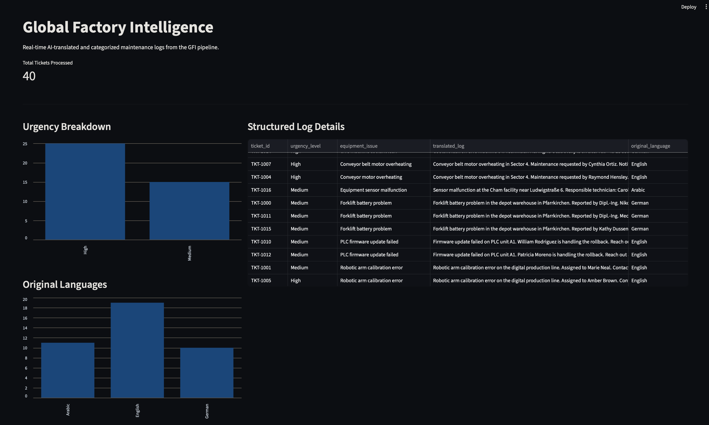

# Global Factory Intelligence (GFI)

**An Enterprise-Grade AI & Data Engineering Pipeline for Manufacturing Operations**

## Overview
The Global Factory Intelligence (GFI) pipeline is an automated, LLM-native workflow designed to process unstructured, multi-lingual factory maintenance logs. It securely scrubs Personally Identifiable Information (PII) locally, uses Generative AI to extract structured mechanical failure data, and serves the analytics through a live dashboard.

This project demonstrates the core competencies of a **Data Engineer**, bridging the gap between traditional data pipelines and applied enterprise AI.

## Architecture & Tech Stack

<details>
  <summary><b>Click to view the Airflow Orchestration DAG</b></summary>
  
</details>

* **Ingestion & Data Privacy:** Python (Faker, Regex) for local PII masking before cloud execution.
* **AI Extraction:** Google Gemini 2.5 Flash API (Structured JSON mode) for translation and semantic extraction.
* **Orchestration:** Apache Airflow (containerized via Astro CLI) scheduling daily batch jobs.
* **Cloud Data Warehouse:** Google BigQuery for scalable, serverless data storage.
* **Business Intelligence:** Streamlit for real-time operational dashboards and RAG-ready interfaces.

<details>
  <summary><b>Click to view the Streamlit BI Dashboard</b></summary>
  
</details>

## Key Features
1.  **Multi-Lingual Processing:** Seamlessly handles and translates technical maintenance logs from Arabic, German, and English into a standardized schema.
2.  **Zero Data Retention Compliance:** Masks all technician names, emails, and phone numbers locally to ensure PII never reaches the external LLM.
3.  **Semantic Batching:** Utilizes asynchronous API calls and exponential backoff (`tenacity`) to respect API rate limits while optimizing throughput.
4.  **Idempotent Cloud Loading:** Statically defines BigQuery schemas to prevent downstream pipeline failures from LLM hallucinations.

## Repository Structure (Monorepo)

```text
Global-Factory-Intelligence/
├── dags/                           # Airflow DAG definition (gfi_maintenance_dag.py)
├── include/
│   ├── Ingestion/                  # Synthetic multilingual data generation & PII masking
│   ├── Extraction/                 # Async Gemini LLM structuring logic
│   ├── Loading/                    # BigQuery schema definition & loading scripts
│   └── keys/                       # Secure directory for GCP Service Account keys
├── app.py                          # Streamlit dashboard application
├── Dockerfile                      # Astro CLI image configuration
├── requirements.txt                # Python dependencies
└── README.md
```

## ⚙️ How to Run Locally
### 1. Prerequisites
* Docker installed and running (OrbStack recommended for Apple Silicon).

* Astro CLI installed (brew install astro).

* A Google Cloud Platform (GCP) Service Account key with BigQuery access.

* A Gemini API Key.

### 2. Environment Setup

Create a ``` .env ``` file in the root directory and add your keys:
Code snippet
```text
GEMINI_API_KEY="your_api_key_here"
GOOGLE_APPLICATION_CREDENTIALS="/usr/local/airflow/include/keys/your_gcp_key.json"
```
### 3. Start the Pipeline
Initialize and start the Airflow cluster:

```text
astro dev start
```
Navigate to http://localhost:8080 (default credentials: admin / admin) to unpause and trigger the gfi_daily_etl DAG.

### 4. Launch the Dashboard
In a separate terminal, run the Streamlit application to visualize the BigQuery data:
```text
streamlit run app.py
```

## Author
**Hazem Elgendy** 
Master's Candidate in Applied AI for Digital Production Management Deggendorf Institute of Technology